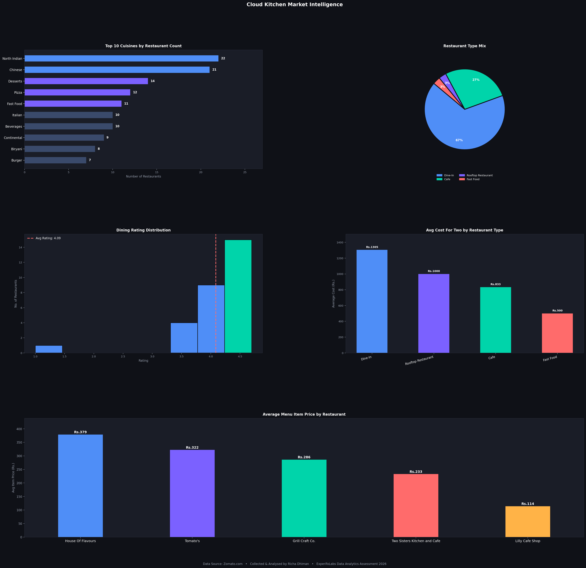
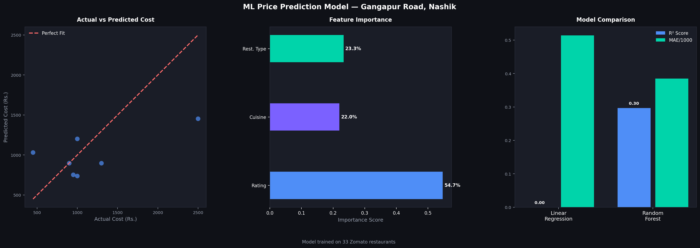

# 🍽️ Cloud Kitchen Market Intelligence
### End-to-End Data Analytics Project | Gangapur Road, Nashik


---

## 📌 Project Overview

A full-stack market intelligence study on the food delivery ecosystem in **Gangapur Road, Nashik** — built as part of the ExperifoLabs Data Analytics Internship Assessment.

This project goes beyond basic data collection to include **API investigation, automated Python analysis, machine learning price prediction, SQL database design, and an interactive Power BI dashboard** — all using real data collected from Zomato.

---

## 🎯 Key Findings

| Finding | Detail |
|---|---|
| 🔴 Most Saturated Cuisine | North Indian — appears in 85% of restaurants |
| 🟢 Biggest Market Gap | Thai & Lebanese — only 1 restaurant each |
| ⭐ Average Dining Rating | 4.09 out of 5 |
| 💰 Average Cost For Two | ₹856 |
| 🏆 Most Efficient Restaurant | Barbeque Nation — 4.5 rating, 1369 reviews |
| 🍕 Most Expensive Menu Item | Patiyala Seekh Kebab — ₹499 |
| 🥗 Most Affordable Menu Item | Plain Maggie — ₹50 |

---

## 📁 Project Structure
cloud-kitchen-market-intelligence/
│
├── 📊 Data Files
│   ├── cleaned_dataset.csv      # 33 restaurants — cleaned and structured
│   ├── menu_dataset.csv         # 50 menu items across 5 restaurants
│
├── 🐍 Python Scripts
│   ├── analysis.py              # Full data analysis + 5 chart dashboard
│   ├── ml_model.py              # ML price prediction model
│
├── 📈 Visualizations
│   ├── analysis_charts.png      # 5-chart dark themed dashboard
│   ├── ml_model_charts.png      # ML model performance charts
│
├── 🗄️ Database
│   ├── queries.sql              # Schema + 6 SQL queries
│
└── 📊 Dashboard
└── CloudKitchen_Dashboard   # Interactive Power BI dashboard

---

## 🔧 Tech Stack

| Tool | Purpose |
|---|---|
| Python | Data analysis and ML modelling |
| Pandas | Data cleaning and manipulation |
| Matplotlib + Seaborn | Data visualization |
| Scikit-learn | Machine learning (Linear Regression + Random Forest) |
| Power BI | Interactive dashboard |
| SQL | Database schema and querying |
| Chrome DevTools | API investigation |
| Zomato.com | Primary data source |

---

## 📊 Project Components

### Part 1 — Data Collection
- Manually collected data for **33 restaurants** from Zomato
- Captured: name, cuisine, dining rating, delivery rating, reviews, cost, address, type
- Classified restaurants as Cloud Kitchen / Dine-In / Cafe

### Part 2 — API Investigation
- Used Chrome DevTools Network tab to intercept Zomato API calls
- Identified 3 endpoints: restaurant listing, rating data, booking slots
- Documented request URLs, methods, and JSON response structures

### Part 3 — Menu Intelligence
- Collected 50 menu items across 5 selected restaurants
- Captured: category, item name, price
- Identified bestsellers, highest and lowest priced items

### Part 4 — Data Cleaning
- Handled missing values, standardised cuisine names
- Replaced 0 delivery ratings with N/A
- Documented all transformations before and after

### Part 5 — Business Analysis
- Cuisine saturation analysis
- Market gap identification
- Cloud kitchen launch recommendation with ₹5L capital breakdown
- Operational efficiency analysis

### Part 6 — SQL
- Designed 2-table schema (restaurants + menu_items)
- Wrote 6 queries including 2 bonus queries

### Part 7 — Python Analysis + ML
- Automated analysis pipeline with 5 professional charts
- ML price predictor using Random Forest (R² = 0.30)
- Feature importance: Rating (54.7%), Restaurant Type (23.3%), Cuisine (22%)

### Part 8 — Power BI Dashboard
- 2-page interactive dashboard
- Page 1: Cuisine saturation, restaurant types, cost analysis
- Page 2: Menu intelligence with price comparison

---

## 📸 Visualizations

### Analysis Dashboard


### ML Model Performance


---

## 🚀 How to Run

### Requirements
```bash
pip install pandas matplotlib seaborn scikit-learn
```

### Run Analysis
```bash
python analysis.py
```

### Run ML Model
```bash
python ml_model.py
```

---

## 💡 Business Recommendation

Based on data analysis, launching a **Thai Cloud Kitchen** in Gangapur Road offers:
- ✅ Zero direct competition
- ✅ Growing demand from young professionals
- ✅ Low overhead (cloud kitchen model)
- ✅ Pricing sweet spot: ₹200-400 per order

**Capital allocation (₹5 lakhs):**
- ₹2L — Kitchen setup
- ₹1L — Equipment
- ₹1L — Ingredients (3 months)
- ₹1L — Marketing + Zomato/Swiggy listing

---

## 👩‍💻 About

**Richa Dhiman**
Data Analyst | Python | SQL | Power BI | Machine Learning

📧 richadhiman820@gmail.com
🔗 [GitHub](https://github.com/richa-cd)

---

*Data collected from Zomato.com | ExperifoLabs Data Analytics Assessment | June 2026*
